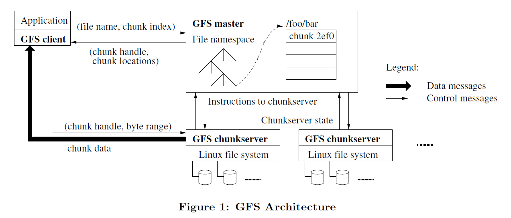
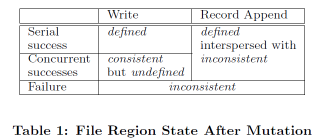
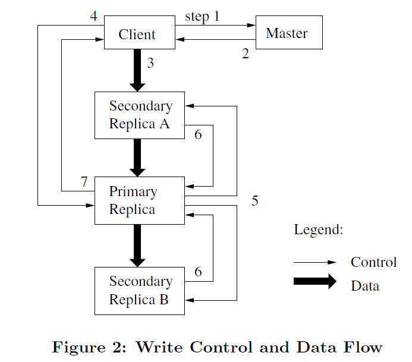

# GFS论文阅读笔记

## 1. Introduction
    
GFS在performance、scalability、reliability、availability方面与传统DFS目标一致，但是需要考虑几个新的方面：
1.  Component failure是常态而非exception，因为采用的是廉价硬件。
2.  文件通常很大，几GB的很常见。这与传统文件系统的需求很不一样，因此I/O操作和block size都需要重新考虑。
3.  大多数文件都是追加数据而非覆盖写。一旦写入，文件通常只会被顺序读取，因此在client端cache data便失去了意义。
4.  文件系统API与application一起设计提升了系统的flexibility。例如我们放松了GFS的一致性模型，以便不会给application太多负担。

## 2. Design overview
### 2.1 assumptions
进行GFS设计时考虑的假设列表：
* 系统构建在廉价硬件之上，硬件故障常见。节点必须持续监控自己，一旦出现故障，detect、tolerate、recover要迅速。
* 系统存储很多大文件。期望数量是几百万个，每个通常100MB及以上。几个GB的也很常见。支持小文件，但不必针对小文件进行优化。
* Workload主要包含两种read操作：large streaming read和small random read。有性能意识的application会将自己的small read操作进行batch和sort以确保它们顺序读取一个文件，不会前后跳跃。
* Workload也包括很多大的顺序写，即追加数据到文件末尾。特定位置的small write操作也支持，只是不需要很高效。
* 系统必须高效实现多个client同时追加数据到同一个文件的情况。我们的file通常被用作生产者-消费者队列或者多路归并，也就是会有多个写入端同** 高持续带宽比低延迟更重要。因为大部分是数据的高速批量操作。

### 2.2 Interface
GFS提供了熟悉的文件系统接口，支持常见的文件操作，如create、delete、open、close、read、write。此外，GFS还支持snapshot、record append操作。
### 2.3 Architecture
GFS cluster包含单个master和多个chunkserver。

文件被分割为固定size的chunk，每个chunk有唯一64位的全局handle（句柄），master创建该chunk时生成。Chunkserver以普通Linux文件形式存储chunk，根据chunk handle和byte range（即要操作哪个chunk的哪些字节）来对一个特定chunk进行读写。每个chunk会复制到多个chunkserver上保证reliability，通常三副本。
Master保存文件系统的metadata。包括namespace、访问控制信息、file到chunk的映射信息、chunk的当前location；它也控制系统级活动，如chunk lease管理，孤儿chunk回收，chunk迁移。Master周期性与每个chunkserver进行heartbeat信息通信来发送指令和收集chunkserver的state信息。  
GFS client实现了文件系统API来与master/chunkserver通信，进行数据读写。Client与master通信进行metadata操作，所有的数据通信都直接与chunkserver通信。
Client和chunkserver都不会cache file data。这样避免了cache一致性问题的处理。Client只会cache metadata。Chunkserver不需要cache file data是因为chunk都是Linux file，因此Linux系统的buffer cache会自动缓存经常访问的数据到内存。

### 2.4 Single master
单个master大大简化了系统设计，也可以是master能根据global knowledge进行复杂的chunk placement、replication决策。但我们应该尽量最小化其对读写操作的参与，避免使master称为系统瓶颈，所以client直接与chunkserver通信进行数据读写。
    
### 2.5 Chunk size
size定为64MB，比传统文件系统大得多。每个chunk作为一个Linux文件存储，采用惰性空间分配策略，避免chunk内部有碎片空间浪费。  
**大的chunk size带来的好处：**
* 减少了client与master的交互，因为同一个chunk的读写可操作的数据量更大了。
* 对于一个大chunk，client的操作更多的落在这个chunk里，这样减少网络开销，因为同一个TCP连接可以做的事更多。
* 减少了metadata的size，可以使metadata存储在master的内存中。
**缺点：**  
* 小文件可能只包含一个chunk，这样的文件很容易成为访问热点，热点问题的解决方法是提高副本数量，或者允许一个client从其他client处读取相同文件。

### 2.6 Metadata
Master在内存中存储三种metadata：
* File和chunk的namespace
* File到chunk的映射
* 每个chunk的副本的location
其中前两种metadata还会持久化元数据修改的operation log到磁盘，并同步给备用节点，chunk的location信息不会持久化存储，master只会在启动时或者一个chunkserver上线时询问它关于chunk的location信息。
#### 2.6.1 In-Memory Data Structures
既然采用内存存储metadata，就要考虑容量问题，即固定内存大小能够容纳多少数据量。
每个chunk所需的元数据大小小于64 Byte，每个file的namespace信息也少于64 Byte。
而且master添加内存很容易。
#### 2.6.2 Chunk location
Master不持久化chunk location信息，它会在启动时统计一次，后续通过heartbeat更新。
#### 2.6.3 Operation log
OP log用来记录metadata操作及顺序，且采用本地和远端存储，master利用它恢复metadata，为了限制log大小及降低replay时间开销，采用checkpoint技术，当log达到一定大小后，进行一次checkpoint。Checkpoint采用压缩的B-tree实现，可以直接映射到内存中，且可用于namespace lookup而不需要额外解析。这也加速了恢复过程，提高了系统可用性。
Recovery过程中只需最新的checkpoint和后面的log，进行重放即可。

### 2.7 Consistency model
#### 2.7.1 Guarantees by GFS
File namespace的操作（如create）是原子的，这种操作只由master执行，namespace通过加锁来保证原子性和正确性。

File region的state分为defined、undefined、consistent、inconsistent。区别如下：
* Consistent：所有的client都能看到相同的data，无论读取哪一个副本。
* Defined：不仅是consistent的，而且client能够看到全部的修改（mutation writes in its entirety）。
* Undefined & consistent：发生在并发写入的场景，client可以看到相同的数据，但是无法知道每个mutation操作是什么。因为多个并发的mutation操作可能并融合到一起了。
* Inconsistent（蕴含着undifined）：有mutation失败了。

GFS保证mutation成功的方法是：
a. 在chunk的所有副本上按相同的顺序执行mutation；
b. 使用chunk version number来检查哪些chunk是过期的。
由于client会cache chunk location信息，那么如果一个chunk过期了，如果让client发现呢？通过cache过期的timeout和对应file的下一次open来发现。但是由于我们的chunk通常都是append-only的，所以过期的chunk通常比较短，client访问时发现到达结尾了，会重新请求master获取新的chunk location信息。
    Chunkserver故障如何发现？通过master与所有chunkserver的handshake来发现。
    Chunkserver的硬盘故障可能会引起Data corruption即数据错误，这个可以利用checksum来检查。
#### 2.7.2 Implications for applications（对app的启示）
通常application只进行append操作，没有overwriting操作。Application也可以定期进行checkpoint操作，checkpoint中可以加入application-level的checksum，以便application挂掉之后可以增量重启，之前写入的数据不会丢失。
    Application对于每个record的正确性可以鉴别，因为每个record被写入之前都会具备checksum信息。对于duplicated record，如果application不是幂等的，那么它会自动丢弃出现的重复记录。
## 3. System interactions
### 3.1 Leases and mutation order
Master将lease赋予chunk的某个replica，作为primary，primary replica执行所有的mutation（按一定顺序），然后其他replica也按primary的order执行mutation。
Lease机制是为了减小master的管理负担，lease的初始timeout是60s。但是，只要chunk一直在被写入，那么primary就可以无限请求延长lease，延长lease请求和授权回复都会集成在master与chunkserver的heartbeat消息中。Master也可以在lease到期之前revoke它（当master对一个file进行rename时它不想它的内容被修改）。当master和primary失联时，它会在lease过期之后授权给其他replica。
Figure-2是write的control和data流程。主要包含以下步骤：

1.  Client询问master哪个chunkserver持有目标chunk的lease，以及其他replica的location信息。如果没有server持有lease，master会立即授予给一个。
2.  Master回复primary的身份和其他replica的locations。Client会cache这些信息。当primary变得不可达时或者它回复说自己没有lease了时，client才会重新联系master。
3.  Client发送数据给所有的replicas。Client可以以任何order做这件事。通过解耦数据和控制流，我们可以利用网络拓扑来规划data flow，这样可以提高传输性能。
4.  一旦所有的replica确认收到了data，client就发送write request给primary。然后primary开始确定所有mutation（可能来自多个并发client）的order并在本地执行。
5.  Primary下发write request给所有的replicas。
6.  Secondary replica回复给primary已经执行完毕。
7.  Primary回复给client。但是执行过程中可能出现error，比如只在primary和部分replica中执行成功（如果primary都失败了，它是不会给其他replica下发写请求的），primary会告诉client是否出现error，一旦出现了，client会认为写入失败了，此时各个chunk的region可能出现不一致状态。Client会首先从第3步开始重试失败的mutation，重试一定次数之后依然失败的话，它就会从第1步开始重新执行整个流程。
如果一个write操作的数据超出了一个chunk的范围，那么GFS client会将其分解成多个写操作。当前Client的写操作中可能夹杂着其他client的写操作（并发写），当前client的写操作也可能被其他client的写操作所覆盖（overwritten）。因此，共享的file region中可能包含来自不同client的fragments，这种情况下file region是consistent但undefined的（即多个写操作融合到一起了，但是所有的replica是identical的即内容相同，因为所有的replica都以相同的order执行mutation）。
### 3.2 Data flow
控制流从client流向primary，然后从primary流向所有的secondary replica。数据流会线性地流过所有的chunkserver，顺序是精心选择的。我们的goal是充分利用每个机器的网络带宽。
为了充分利用带宽，我们的data flow是线性的，而不是tree型拓扑传输。所以每个机器的出口带宽都可以充分使用，而不是分割给多个接收者。
为了避免网络瓶颈和高延迟链路（比如内部交换机），每个机器只传输给离自己最近的还没有接收data的节点。我们的网络拓扑足够简单，distance可以根据IP地址来估计。
为了最小化传输延迟，我们在TCP连接上使用流水线传输数据。一旦一个chunkserver接收到一些data，它立即发送出去。我们使用全双工链路，因此发送数据不会影响接收数据。没有网络拥塞的情况下，传输B个字节给R个replicas的时间是：
B/T+RL
其中T是网络吞吐率，L是两个machine之间传输数据的延迟。我们的网络是100Mbps，L低于1ms，因此传输1MB数据时间大概是80ms。
### 3.3 Atomic record append
传统的write操作中，client会指定offset和data，这样多个client并发write是无法串行化的：因为region可能会包含来自多个client的数据段。GFS的record append操作中，client无需指定offset，因为是追加到末尾，GFS保证data会被原子地写入到file中至少一次。写入的offset是由GFS自动选择的，并返回给client。
传统的write实现中，要想支持多个client并发写同一个file，client需要复杂的同步和分布式的lock机制。
Record append操作和上述write操作类似，但多了一些控制逻辑，比如client发送完数据以及写请求之后，primary首先check这些data是否会超出当前chunk的范围，如果会超出，那么primary首先padding满当前chunk，并要求其他replica也这么做。然后回复给client说在下一个chunk中重试。（record append操作限制data最大为1/4*64MB，以便使这种情况尽量少发生）
如果在任何一个replica中失败了，client将重试。这导致的结果是，部分replica可能包含不同的数据，因为有的已经完成写入或者部分写入当前record。GFS不保证所有的replica是字节级相同的（bytewise identical），它只保证data被原子地写入至少一次（data是字节连续地被写入，中间不会夹杂其他数据）。也就是说，写入成功表示data在所有的replica中的相同offset处被写入了。此外，一旦一个record append成功，那么这个record的末尾在各个replicas中处于相同位置（即各个replica是一样长的），这样后续的record写入时会从更高的offset开始。
### 3.4 Snapshot
Snapshot用于给一个file或目录树做一个copy。采用copy-on-write技术实现。
当master收到snapshot请求时，它首先收回所有相关chunk的lease，后续的write操作会重新请求master询问lease，这也给master做copy的机会（中间不能发生数据修改）。
收回lease或者lease过期之后，master用日志记录这个操作并持久化到磁盘。然后master在内存中复制一份目标file的metadata，并和原有metadata一样指向相同的chunk。
Snapshot之后，Client发送write request给其中某个chunk C时，它会首先询问master谁是当前的lease holder。Master意识到目标chunk的引用计数大于1，它推迟回复client，并选取一个新的句柄C’，然后告诉所有拥有chunk C的chunkserver复制一个新的chunk C’出来。这个复制操作是在每个chunkserver的本地执行的，比网络传输要快（磁盘速度大概是百兆网络速度的三倍）。然后master赋予lease给一个C’的replica并回复client，client继续后面的write操作，并不知道这个chunk是复制来的。

## 4. Master operation
Master负责执行所有的namespace操作。此外，它还负责管理chunk副本在系统中的分布，比如决策chunk放在哪台机器，创建chunk及replica，做load balance、垃圾回收。
### 4.1 namespace management and locking
Master没有采用传统FS的数据结构，即一个目录中包含哪些文件。而是用一个lookup table来讲pathname映射到metadata，利用前缀压缩，每个table能够高效地放入内存。Namespace tree中的每个节点（file或者directory）都有一个关联的read-write lock。
文件creation操作不需要获取父目录的write lock，只需要read lock，比如如果要创建文件/home/user/foo，那么需要/home、/home/user的read lock，/home/user/foo的write lock，因为GFS没有inode那种结构，不需要保护父目录，只需保证父目录不被修改即可。
这种锁机制的好处是可以支持并发操作，比如在某个目录下同时创建多个新文件，因为只需要父目录的read lock即可，read lock可以保护父目录不被删除、重命名、snapshotted。
### 4.2 Replica Placement
GFS是高度分布式的，且是多层次的。机器可能在不同的rack中，rack内部网络速度很快，跨rack传输会慢一些。
Chunk的replica分布策略服务于两个目标：最大化数据的可靠性和可用性；最大化利用网络带宽。
因此，rack内副本还不够，要让replica跨rack分布，这样可以应对rack整体挂掉的case。当然也会带来写入速度的降低，这是一个tradeoff。
### 4.3 Creation，re-replication，rebalancing
Chunk replica被创建有三种原因：chunk creation、re-replication、rebalancing。
Chunk creation：master需要选择将新的chunk放到哪个机器，需要考虑三个因素：
* 磁盘空间利用率低于平均值
* 限制每个chunkserver最近新建的chunk数量，因为新chunk意味着后续很重的写入负载
* 分布chunk的replica到不同的racks

Re-replication：当某个chunk的replica总数低于目标值时进行re-replication。发生原因可能是：chunkserver挂了，或者chunkserver报告它的replica被损坏了，或者它的disk出错了，或者副本总数被提高了。每个chunk的re-replication是有优先级的，规则如下：一个chunk副本数越少优先级越高；live file的chunk比deleted file的chunk优先级更高；阻塞client progress的chunk优先级更高。
Master选择最高优先级的chunk进行re-replication，并指示某个chunkserver进行clone操作，这个新的replica存在哪与chunk creation的选择机制一样。为了避免clone操作会影响client traffic，master会限制集群和每个chunkserver的active clone操作的总数。每个chunkserver也会限制给每个clone操作的bandwidth（通过限制到source chunkserver的read request来实现）。
Rebalancing：master会周期性地检查当前replica分布是否合理，不合理的话就进行重分布。Master会逐渐给一个new chunkserver分配chunk，而不是突然给它很多chunk。它也会给disk space太少的chunkserver移除一些chunk。
### 4.4 Garbage collection
一个file被delete之后，它的空间并不会马上被回收，而是通过定期的垃圾回收来完成，这会使系统更简单可靠。
#### 4.4.1 Mechanism
当删除一个file时，master首先在log中记录这个操作。File会被命名为一个hidden name（变为隐藏文件），其中包含删除时间。Master会定期scan文件系统的namespace，发现这样的隐藏文件就判断它的存在时间，如果超过三天了就删除。这之前，该文件依然可以被读取到，且可以通过重命名恢复为正常文件。当它被删除之后，它的内存metadata也erase了，所有的chunk都删除了。
在regular scan of the chunk namespace过程中，master会识别孤儿chunk（不属于任何file的chunk）并erase它们的metadata。在chunkserver与master的heartbeat信息中，chunkserver汇报自己持有的chunk，master识别这些chunk，并回复哪些chunk的metadata已经清除了，然后chunkserver就可以在本机删除这些chunk了。
#### 4.4.2 Disscussion
GFS实现垃圾回收很简单，因为我们知道file-to-chunk的映射，以及每个chunk replica分布在哪，其他任何master不知道的chunk都是garbage。
垃圾回收相对于立即删除的优点：
* 在硬件故障频繁的分布式系统中垃圾回收更简单可靠。Replica删除的message可能丢失了，chunk creation可能在部分节点失败了，留下一些master不知道的chunk，垃圾回收提供了可靠地方法删除这些无用的chunk。
* 垃圾回收由master后台空闲时进行，每次可以回收一大批存储空间，回收的开销更低了。也不会影响master响应client的请求（闲时才进行GC）。
* 提供了一个安全机制避免误删文件。
缺点：在存储空间很紧张时会阻碍用户对空间的优化操作。应用程序重复创建、删除文件时可能无法重用相同的存储空间。解决方法：一个文件明确地被再次删除时立即回收其存储空间；也允许用户对不同的namespace指定不同的replica数目，并声明该namespace中的文件删除时是否立即彻底删除。
### 4.5 Stale replica detection
Chunk变为stale，如果一个chunkserver故障错过了一些mutation。对每个chunk，master维护一个chunk version number来区分其是否是最新的。
Master grant lease给某个chunk时，它首先会提高该chunk的version number并通知所有最新的replica。Master和replicas都记录这个最新的version number。这一切都发生在client写入这个chunk之前。如果某个replica挂了，那么它的version number不会变，当它重启后会重新向master汇报自己的chunk和version number，master此时可以检测到过期chunk，如果master看到了比自己记录的还要高的version number，它会假设这是授予lease的时候失败了。
Master在GC中remove stale replicas。此外，master在回复给client的时候会包含chunk的version number，client在读取chunk时会验证version number是否最新（chunkserver clone时也会读取其他chunkserver上的chunk）。

## 5. Fault tolerance and diagnosis（容错和诊断）
### 5.1 High availability
几百台机器的集群，任何机器随时都可能故障，我们保证系统整体高可用主要有两种方法：fast recovery、replication。
#### 5.1.1 Fast recovery
Master和chunkserver被设计为能够在秒级恢复自己的state，无论是怎么terminated的。Client和其他server只会感觉请求有些卡顿，然后超时重试即可。
#### 5.1.2 Chunk replication
Replication机制来保证高可用，多server多rack副本分布。Chunkserver下线或者chunk损坏时master会协调chunk clone执行。我们也在研究奇偶校验和纠删码技术来替代副本。
#### 5.1.3 Master replication
Master的state也会被复制以提供可靠性。Master的operation log和checkpoint会被复制到多个机器。一个mutation的op log只有在master本机以及备用节点上持久化成功才算commit。
Master宕机后，shadow master节点只提供read功能，因为它们只是shadow，不是mirror，所以可能落后于master一些。
一个shadow master读取不断增长的op log并应用于自己的数据结构上。Shadow节点在chunkserver启动时也会和他们通信获取chunk信息，后续也会和他们保持握手信息以感知chunkserver的状态。Shadow节点依赖于primary master获取replica location的update信息。
### 5.2 Data integrity（数据完整性）
每个chunkserver独立地使用checksum来检测数据是否损坏。
每个chunk被分割为64KB的block。每个block有32bit的checksum。像其他metadata一样，checksum存在内存中，并且有log机制持久化，与user data分开存储。
对于read操作，chunkserver首先会校验相关的block，校验通过后才会返回数据，因此一个chunkserver不会传播自己损坏的数据给其他机器。如果自己的数据校验出错，它会返回错误，并通知master，master会进行chunk clone及错误replica的删除。
Checksum对读性能影响很小。首先checksum占用空间小，checksum查找和比较都不需要I/O操作，checksum的计算可以和数据的I/O操作同时进行。
Checksum计算主要针对append操作进行了优化，因为append是我们的主要需求。Chunk的最后一个block可能没有写满，所以它的checksum会被增量update，当新数据追加进来时，我们会更新它的checksum。
对于普通的overwrite写操作，必须首先校验涉及到的第一个和最后一个block的checksum，然后再开始写入。
空闲的时候，chunkserver会scan并验证inactive chunk的内容。及时发现损坏的数据。
### 5.3 Diagnostic tools
诊断日志可以帮助定位问题、调试、性能分析，且开销很小。因为日志是顺序、异步写入的，所以性能影响也很小。
    

